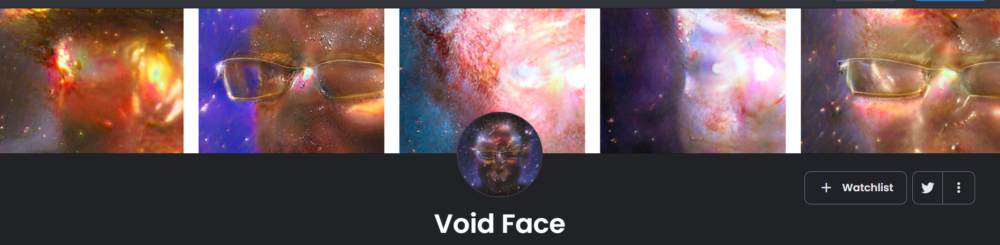

# SpaceFace
Fine tuning, blending of styleGAN2 models and creation animations using latent directions.

---

  

---
## Notes
* This repository uses the official NVlabs StyleGAN2-ADA PyTorch implementation.  
https://github.com/NVlabs/stylegan2-ada-pytorch
* Only 1024 x 1024 styleGAN2 models can be used to create animations.

---
## Open notebooks in Colab 

[Fine tuning notebook](https://colab.research.google.com/github/Quiexx/SpaceFace/blob/main/fine_tuning.ipynb)  
[Animation notebook](https://colab.research.google.com/github/Quiexx/SpaceFace/blob/main/animation.ipynb)  
[Blending notebook](https://colab.research.google.com/github/Quiexx/SpaceFace/blob/main/blending.ipynb) 

---
## Repository structure
| Path | Description
| :--- | :----------
| stylegan2-ada-pytorch | Contains tools to load and train NVlabs stylegan2 models
| datasets | Contains datasets used for fine tuning
| &ensp;&ensp;&boxvr;&nbsp; hubble_1024x1024.zip | Dataset of 261 [Hubble Space Telescope](https://en.wikipedia.org/wiki/Hubble_Space_Telescope) snapshots taken from [Nasa Hubble Space Telescope](https://www.nasa.gov/mission_pages/hubble/multimedia/index.html) page.
| directions | Contains latent directions
| [fine_tuning.ipynb](https://colab.research.google.com/github/Quiexx/SpaceFace/blob/main/fine_tuning.ipynb) | Notebook used for fine tuning
| [blending.ipynb](https://colab.research.google.com/github/Quiexx/SpaceFace/blob/main/blending.ipynb) | Notebook used for blending
| [animation.ipynb](https://colab.research.google.com/github/Quiexx/SpaceFace/blob/main/animation.ipynb) | Notebook used for creating animations

---
## Void Face collection
  
This project was used for creation [Void Face NFT collection](https://opensea.io/collection/void-face).  
All models are stored in 
[huggingface repository](https://huggingface.co/Quiexx/SpaceFace/tree/main).  
All news about this project is posted on [my Twitter](https://twitter.com/Quiexx1).
